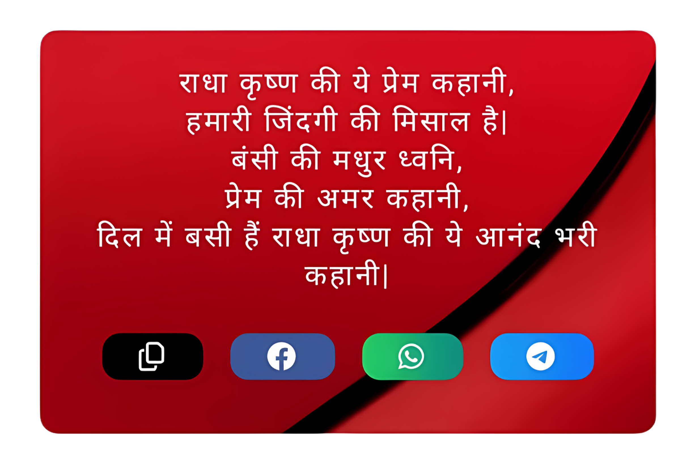
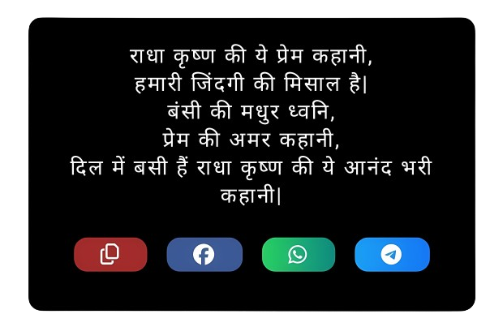
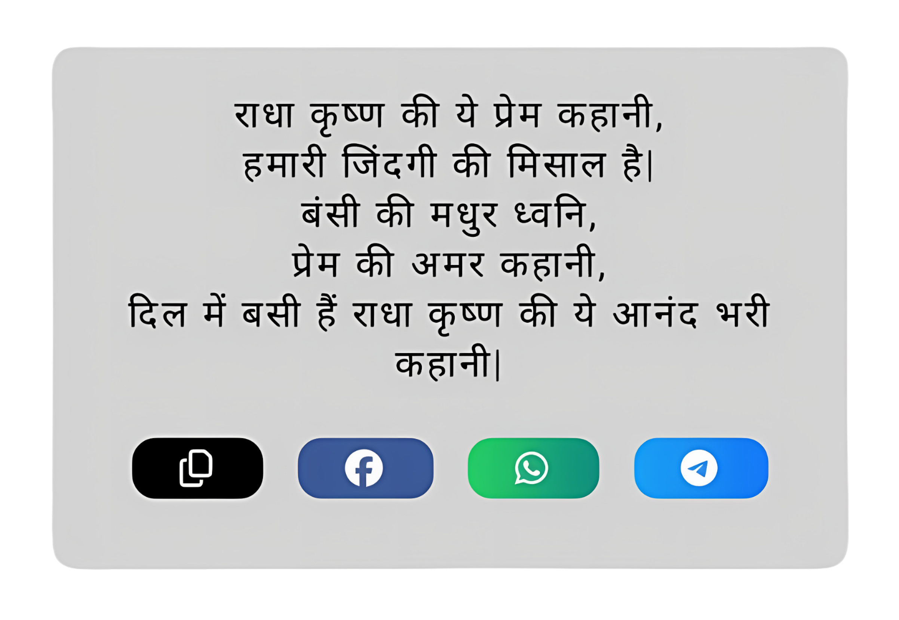

<div>

  
  <h1>What is Quotify Styler</h1>
  
  
  
  <p style="margin: 20px 0; width: 60%;"></p>
    
    
  <p>Quotify Styler is like a magic tool for websites, especially those sharing shayari. It helps make blockquote tags look awesome without the headache of copying and pasting complicated code. Just use our CDN, and you're good to go! Plus, there are different styles to pick from, so your site can have its own cool vibe effortlessly.</p>

  <h2>Features:</h2>
  <ul>
    <li>Just copy & paste 2 lines of code.</li>
    <li>Multiple color options to choose from.</li>
    <li>Responsive design.</li>
    <li>Social share buttons added for increased social media reach.</li>
    <li>Copy text within the blockquote design using the copy button.</li>
  </ul>

  <h2>How To Use:</h2>
  <ol>
    <li>Select which style you want to apply from below.</li>
    <li>Copy the code for that style.</li>
    <li>Paste the CSS code before the /head tag & JS code before /body tag of your website.</li>
    <li>Done.</li>
  </ol>

  <h3 style="color: red; font-weight: bold">⚠ NOTE:</h3>

  <p>If you are using WordPress, make sure to clear the cache if you have any caching plugin enabled.</p>
  
  <h3>How To Use:</h3>
  ## Style 1: Design with Backend Image.
  
 
 <p style="margin: 20px 0; width: 60%;"></p>
 
  
  Include the following code in the `</head>` section of your HTML file:
  
  ```html
  <link rel="stylesheet" href="https://cdnjs.cloudflare.com/ajax/libs/font-awesome/6.5.1/css/all.min.css" integrity="sha512-DTOQO9RWCH3ppGqcWaEA1BIZOC6xxalwEsw9c2QQeAIftl+Vegovlnee1c9QX4TctnWMn13TZye+giMm8e2LwA==" crossorigin="anonymous" referrerpolicy="no-referrer" />
  <link rel="stylesheet" href="https://cdn.jsdelivr.net/gh/MaheshTechnicals/Quotify-Styler-Cdn/styles/style-1/main.css">
  ```
  ### Adding JavaScript CDN
  
  To integrate the JavaScript CDN, include the following script just before the closing `</body>` tag in your HTML file:
  
  ```html
  <script src="https://cdn.jsdelivr.net/gh/MaheshTechnicals/Quotify-Styler-Cdn/styles/style-1/main.js"></script>
  ```
  
  
  
## Style 2: Dark Mode.

<p style="margin: 20px 0; width: 60%;"></p>


### CSS:

```html
<link rel="stylesheet" href="https://cdnjs.cloudflare.com/ajax/libs/font-awesome/6.5.1/css/all.min.css" integrity="sha512-DTOQO9RWCH3ppGqcWaEA1BIZOC6xxalwEsw9c2QQeAIftl+Vegovlnee1c9QX4TctnWMn13TZye+giMm8e2LwA==" crossorigin="anonymous" referrerpolicy="no-referrer" />
<link rel="stylesheet" href="https://cdn.jsdelivr.net/gh/MaheshTechnicals/Quotify-Styler-Cdn/styles/style-2/main.css">
```
  
  ### JS:
  
  ```html
  <script src="https://cdn.jsdelivr.net/gh/MaheshTechnicals/Quotify-Styler-Cdn/styles/style-2/main.js"></script>
  ```
  
  
  ## Style 3 : Light Gray Mode.
  
  
  <p style="margin: 20px 0; width: 60%;"></p>
  
  
  ### CSS:
  
  ```html
  <link rel="stylesheet" href="https://cdnjs.cloudflare.com/ajax/libs/font-awesome/6.5.1/css/all.min.css" integrity="sha512-DTOQO9RWCH3ppGqcWaEA1BIZOC6xxalwEsw9c2QQeAIftl+Vegovlnee1c9QX4TctnWMn13TZye+giMm8e2LwA==" crossorigin="anonymous" referrerpolicy="no-referrer" />
  <link rel="stylesheet" href="https://cdn.jsdelivr.net/gh/MaheshTechnicals/Quotify-Styler-Cdn/styles/style-3/main.css">
  ```
  
  ### JS:
  
  ```html
  <script src="https://cdn.jsdelivr.net/gh/MaheshTechnicals/Quotify-Styler-Cdn/styles/style-3/main.js"></script>
  ```
 
  ## Donate

If you appreciate my work and would like to support more projects like this, you can contribute through the following methods:

**UPI ID:** maheshtechnicals@apl

**PayPal:** [Donate via PayPal](https://www.paypal.com/paypalme/Varma161)

</div>
